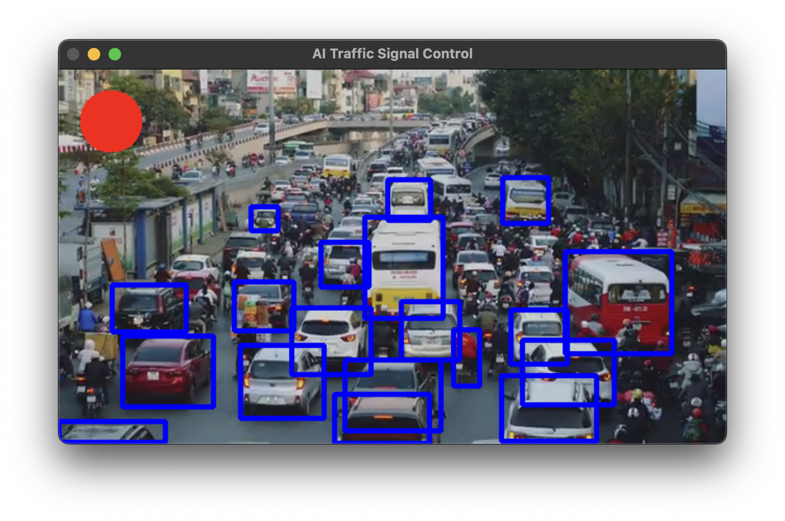

# AmbuRouteAI



An AI-Powered Traffic Management for Emergency Vehicles.

AmbuRouteAI is an AI-powered traffic management system that detects ambulances in real-time and dynamically controls traffic signals to provide a clear path for emergency vehicles. Using YOLOv8 for object detection and OpenCV for traffic light simulation, this system helps reduce ambulance response time and enhances emergency healthcare logistics.

---

## Features

- [x] **Real-time Ambulance Detection** – Uses YOLOv8 AI to identify ambulances from live traffic feeds.
- [x] **Smart Traffic Signal Control** – Dynamically changes traffic lights using OpenCV when an ambulance is detected.
- [x] **Live Video Processing** – Works with webcams or traffic camera feeds to analyze road conditions.
- [x] **Seamless Integration** – Can be extended to IoT-enabled smart city infrastructure.
- [x] **Scalable & Efficient** – Future-ready for integration with Google Maps API for real-time route optimization.

---

## Tech Stack

| Component         | Technology/Tool       |
|------------------|----------------------|
| **AI Model**     | YOLOv8 (Ultralytics)  |
| **Computer Vision** | OpenCV, NumPy       |
| **Backend**      | Python                |
| **Traffic Simulation** | OpenCV          |
| **Live Video Input** | Webcam / CCTV Feed |

---

## How It Works

1. **AI-Powered Detection** – YOLOv8 identifies ambulances in real-time from traffic video feeds.
2. **Traffic Light Control** – If an ambulance is detected, the traffic light turns green; otherwise, it remains red.
3. **Visual Alerts & UI** – The system draws bounding boxes around detected ambulances and simulates traffic signals.
4. **Extensibility** – The project can integrate with Google Maps API & IoT sensors for smarter city-wide traffic control.

---

## Installation & Setup

### Run

Download [yolov8n.pt](https://github.com/ultralytics/assets/releases/download/v0.0.0/yolov8n.pt)

```bash
git clone https://github.com/mantreshkhurana/AmbuRouteAI.git
cd AmbuRouteAI
python -m venv venv
source venv/bin/activate
pip install -r requirements.txt
python main.py -p traffic_video.mp4  # Use an MP4 file
python main.py -l  # For live webcam feed
```

> Optional: set `GOOGLE_MAPS_API_KEY` in your environment to enable GPS proximity checks and route optimization.

---

## Future Enhancements

- [ ] **Integrate with Google Maps API** – Real-time traffic data for route optimization.
- [ ] **IoT-Based Smart Traffic Signals** – Connect with Raspberry Pi & Arduino for real-world applications.
- [ ] **Hospital Alert System** – Send emergency notifications to hospitals about incoming patients.
- [ ] **Mobile App Interface** – Develop an ambulance tracking app with live traffic updates.

---

## Authors

- [Mantresh Khurana](https://github.com/mantreshkhurana)
